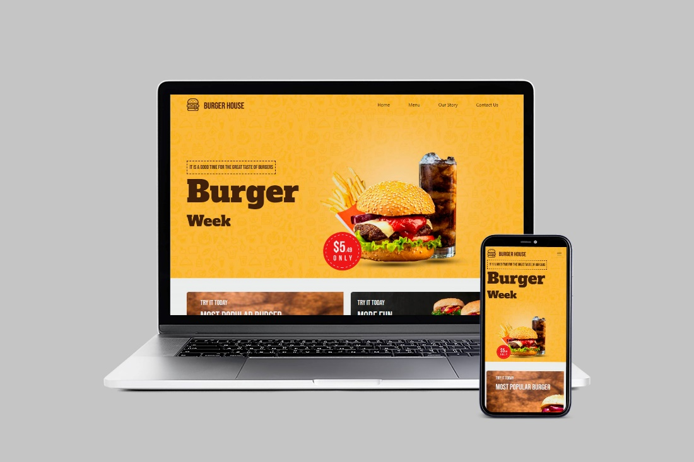
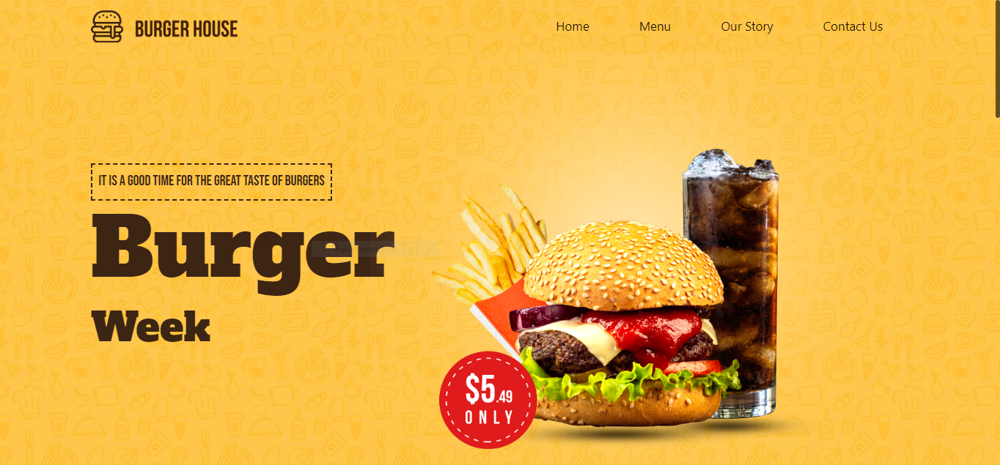
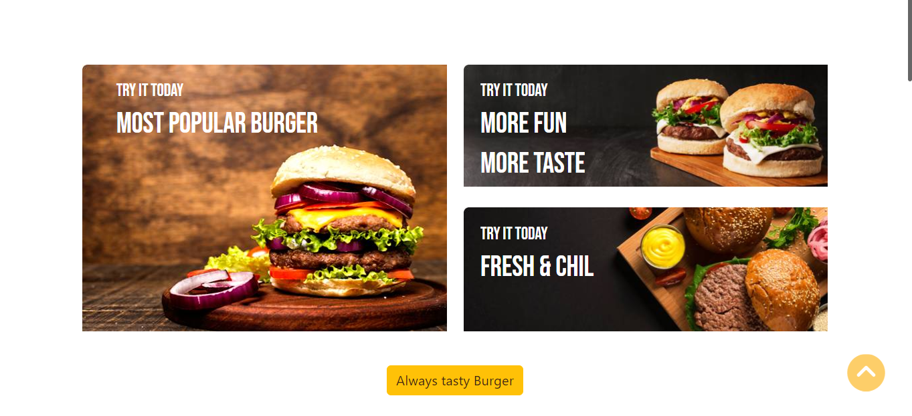
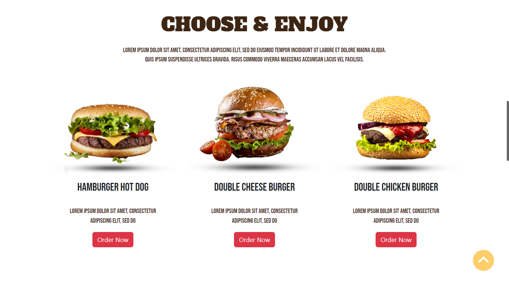
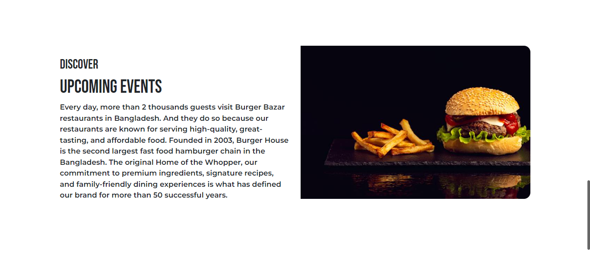
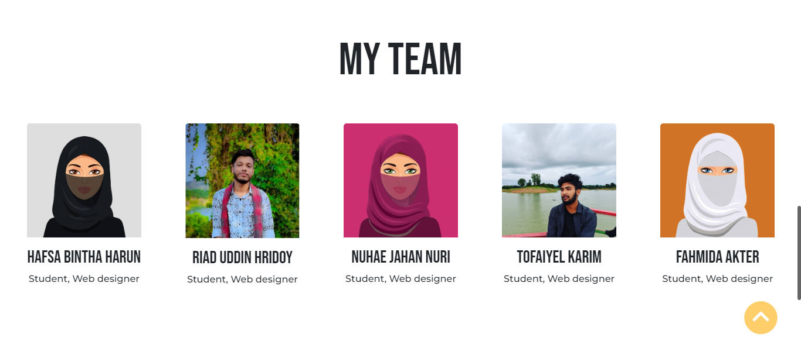
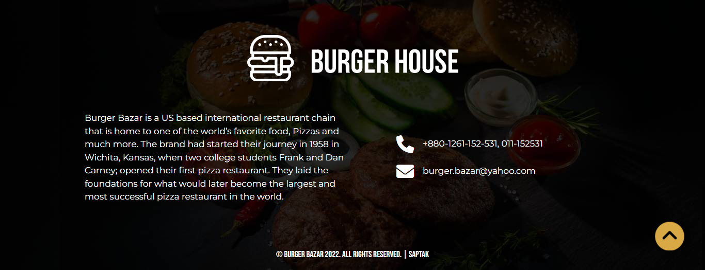

## Project Name: Burger House, a food website
---
### Using tools or technologies for this project
- HTML
- CSS
- Bootstrap
- Owl Carousel
- VS code
- Netlify
- Font Anwesome Icons
- Chrome dev tool
---
### Some features of this project
- Responsive
- Bottom to top
---
### Project contributors

- Saptapan Barua
- Riad Uddin Hridoy
- Tofaiyel Karim
- Fahmida Akter
- Hafsa Bintha Harun
- Nuhae Jahan Nuri
---
### Some screenshots of website of this project

---
